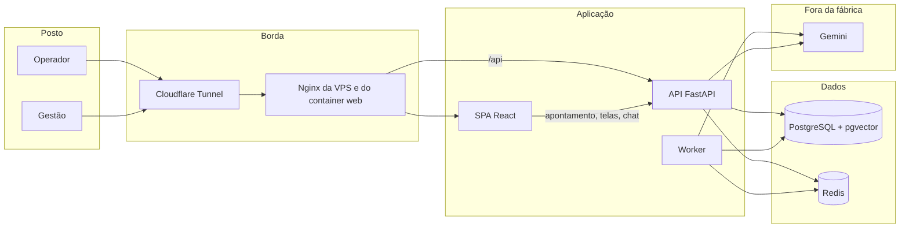
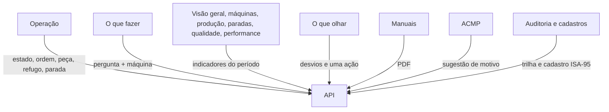
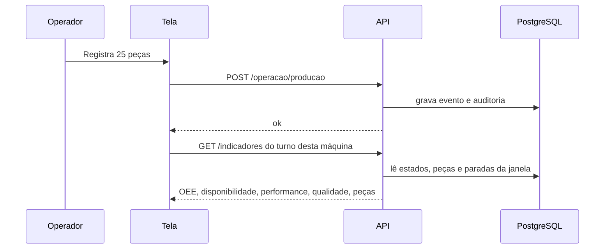
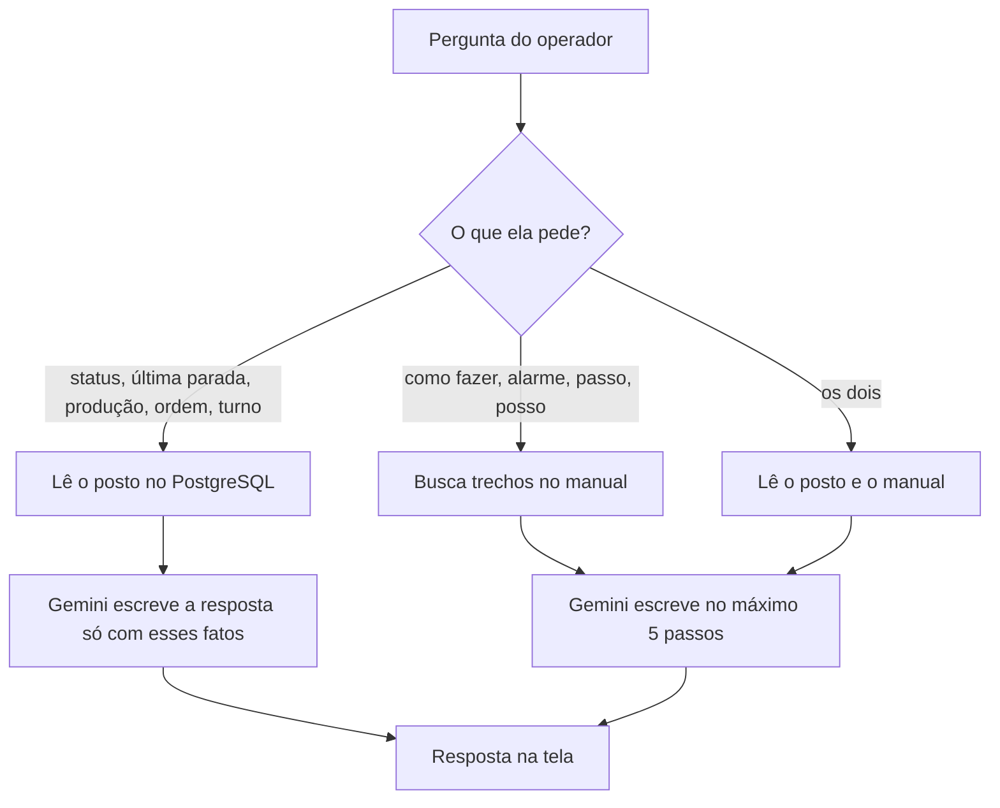

# Como a aplicação OEE DiFORP funciona

Este texto descreve o sistema inteiro: quem fala com quem, o que cada parte faz, como o chat responde, o que já está sólido, o que vale melhorar e para onde as próximas versões podem ir.

O browser não calcula OEE. Ele mostra o que a API devolve. O número mora no PostgreSQL.

## Visão geral

Na VPS o site público entra pelo túnel Cloudflare e cai no Nginx, que entrega a tela e encaminha `/api` para a API. Postgres e Redis ficam na rede interna do Docker. O túnel não abre porta de entrada na máquina.

## As quatro camadas da API

A dependência só anda para dentro: a tela chama a API, a API chama o caso de uso, o caso de uso chama o domínio. O domínio não conhece banco nem Gemini.

| Camada | Onde | O que faz |
| --- | --- | --- |
| Apresentação | `apps/api/src/oee/presentation` | Rotas HTTP, login JWT, papéis `operador` e `gestao` |
| Aplicação | `apps/api/src/oee/application` | Abrir ordem, apontar peça, parada, indicadores, fatos do posto para o chat |
| Domínio | `apps/api/src/oee/domain` | Fórmula do OEE, turno, demo, regras de parada e microparada |
| Infraestrutura | `apps/api/src/oee/infrastructure` | PostgreSQL, fila, PDF, embeddings, modelo ACMP |

A tela está em `apps/web`. Ela segue as mesmas rotas da prova de conceito em `legacy/`, que continua como especificação e não é o produto.

## O que cada tela usa

Papéis:

- **Operador** usa Operação, O que fazer e a parte de Configurações que ele pode ver. Não altera simulação, ACMP nem importação.
- **Gestão** vê o conjunto: indicadores, máquinas, manuais, auditoria e cadastros.

Regras que a tela não pode furar:

- Sem ordem aberta não se aponta produção.
- Abrir ordem começa em Setup. Produção só depois da liberação.
- Microparada é até 5 minutos e a máquina já voltou. Acima disso é parada com motivo.
- Pedido de manutenção deixa a máquina em Manutenção. O operador não religa sozinho.
- A cor do cartão não é o estado. Vale o nome: Produzindo, Setup, Parada, e assim por diante.

## Como um apontamento vira número

A Operação pede só o **turno atual** da máquina escolhida. A Visão geral pede o período do filtro (24 horas, 7 dias, e outros). Por isso um número pode existir no histórico e ainda aparecer vazio no turno da tarde, se naquele intervalo não houve peça.

O worker, em paralelo, pode simular o posto quando a simulação está ligada, indexar PDF que chegou na fila e retreinar o ACMP de tempos em tempos.

## Como o chat funciona

O chat tem dois caminhos. Ele escolhe pelo texto da pergunta.

**Pergunta de posto** (status, última parada, quanto produziu, ordem, operador, turno):

1. A API localiza a máquina pelo seletor ou pelo nome escrito na frase.
2. Lê no banco, sem carregar a fábrica inteira: estado e desde quando, turno, operador, ordem aberta, peças do turno (produzidas, aprovadas, refugo, retrabalho, meta) e as três paradas mais recentes, com motivo.
3. O Gemini só pode usar esse bloco. Se o número não estiver lá, a resposta diz que não tem o dado. Se o modelo falhar, a tela recebe os fatos crus.

**Pergunta de procedimento** (o que fazer, alarme, troca, passo):

1. A pergunta vira um vetor no Gemini (`gemini-embedding-001`, 768 dimensões).
2. O pgvector devolve os trechos mais próximos dos PDFs daquela máquina, mais os manuais gerais da planta.
3. O Gemini monta até cinco ações e uma linha sobre chamar ou não a manutenção.
4. Se o manual não tiver o passo, a resposta pede o supervisor. Ela não inventa torque, alarme nem peça.

O chat não liga, não desliga e não aponta na máquina. Ele lê e orienta.

## Pontos positivos

- O cálculo do OEE está na API, com uma fórmula só. A tela não recalcula por conta própria.
- Operador e gestão têm papéis separados, com trilha de auditoria nos apontamentos.
- O manual vira passo a passo no posto, e o chat agora também responde o estado real da máquina.
- O ACMP sugere motivo de parada e registra se o operador aceitou ou não.
- A demonstração sobe com máquinas, turnos e manuais, então dá para mostrar o produto sem chão de fábrica ligado.
- O deploy na VPS deixa o banco e a fila fora da internet e publica só a tela pelo túnel.

## Melhorias já aplicadas

- A Operação separa o relógio do cartão. O cronômetro anda a cada segundo. A janela do turno só muda a cada 20 segundos, e o número anterior permanece na tela enquanto a resposta nova chega.
- "Registrar parada" abre o formulário na hora. A sugestão do ACMP entra no campo depois, sem segurar o modal.
- A Operação pede o conjunto só da máquina escolhida. Indicadores e sugestão de parada também montam só essa máquina, na janela pedida, sem a trilha de auditoria.
- O chat de posto devolve na hora, direto do banco, o estado, a produção, o OEE do turno, se a meta foi batida, a última peça e a comparação com o turno anterior. O modelo só entra na pergunta de procedimento do manual.
- No servidor, as senhas de demonstração, o `JWT_SECRET` e a senha do Postgres deixam de ser os valores de exemplo. O ambiente local de desenvolvimento continua com os padrões do `.env`.
- Sem `GEMINI_API_KEY`, o passo a passo do manual não responde. O status, o OEE e as paradas do posto continuam saindo direto do banco.
- Na virada (06:00, 14:00 e 22:00, horário de São Paulo) o estado aberto fecha e reabre no turno novo. O relógio do posto conta o tempo neste turno. O OEE não herda a hora de ontem.

## Versões possíveis

**Versão atual.** Posto e gestão no browser, OEE no servidor, manuais em PDF, chat com procedimento e com status, ACMP, auditoria e dados de demonstração. Publicação por túnel Cloudflare.

**Próxima versão, ainda neste produto.** Operação com cartão estável, parada abrindo na hora, consulta só da máquina, chat com OEE do turno, meta, última peça e turno anterior, e segredos de demonstração trocados no servidor.

**Versão seguinte.** Alertas para a gestão quando uma parada passa do tempo ou o refugo sobe. Mais de uma planta de verdade, com o mesmo contrato de telas. Retreino do ACMP com as paradas que o operador classificou, e a tela mostrando se a sugestão está acertando.

**Versão de chão de fábrica.** O estado deixa de depender só do apontamento manual e passa a receber sinal da máquina, com o operador confirmando o motivo. O tablet segue útil sem rede por um tempo e sincroniza depois. O chat continua sem comandar o equipamento: ele explica o passo e mostra o que o posto já registrou.
