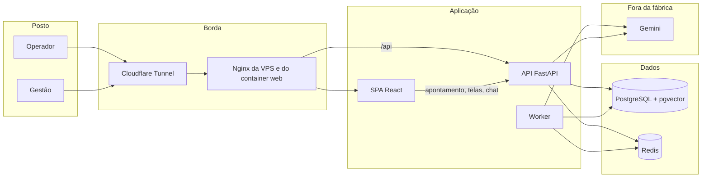
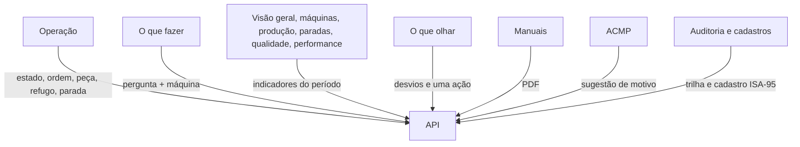
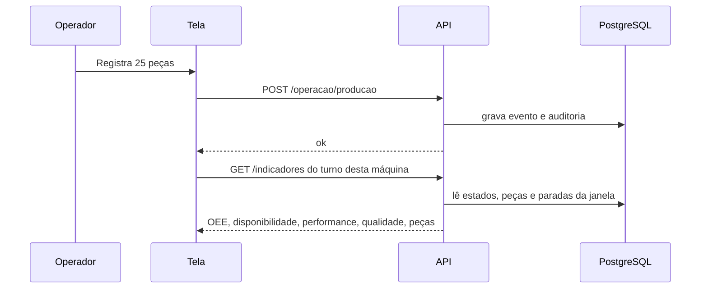
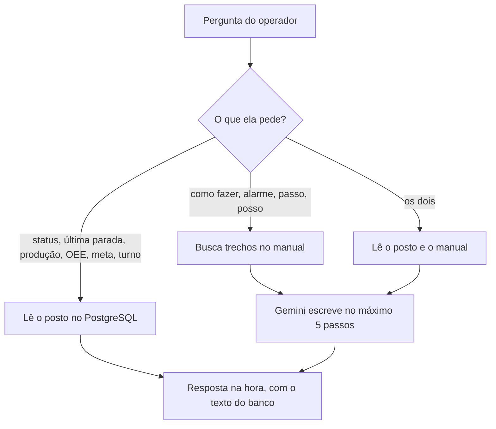

# Como a aplicação OEE DiFORP funciona

Este texto descreve o sistema inteiro: quem fala com quem, o que cada parte faz, como o chat responde, o que já está sólido, o que vale melhorar e para onde as próximas versões podem ir.

O browser não calcula OEE. Ele mostra o que a API devolve. O número mora no PostgreSQL.

## Visão geral

Na VPS o site público entra pelo túnel Cloudflare e cai no Nginx, que entrega a tela e encaminha `/api` para a API. Postgres e Redis ficam na rede interna do Docker. O túnel não abre porta de entrada na máquina.

## As quatro camadas da API

A dependência só anda para dentro: a tela chama a API, a API chama o caso de uso, o caso de uso chama o domínio. O domínio não conhece banco nem Gemini.

| Camada | Onde | O que faz |
| --- | --- | --- |
| Apresentação | `apps/api/src/oee/presentation` | Rotas HTTP, login JWT, papéis `operador` e `gestao` |
| Aplicação | `apps/api/src/oee/application` | Abrir ordem, apontar peça, parada, indicadores, fatos do posto para o chat |
| Domínio | `apps/api/src/oee/domain` | Fórmula do OEE, turno, demo, regras de parada e microparada |
| Infraestrutura | `apps/api/src/oee/infrastructure` | PostgreSQL, fila, PDF, embeddings, modelo ACMP |

A tela está em `apps/web`. Ela segue as mesmas rotas da prova de conceito em `legacy/`, que continua como especificação e não é o produto.

## O que cada tela usa

Papéis:

- **Operador** usa Operação, O que fazer e a parte de Configurações que ele pode ver. Não altera simulação, ACMP nem importação.
- **Gestão** vê o conjunto: indicadores, máquinas, manuais, auditoria e cadastros.

Regras que a tela não pode furar:

- Sem ordem aberta não se aponta produção.
- Abrir ordem começa em Setup. Produção só depois da liberação.
- Microparada é até 5 minutos e a máquina já voltou. Acima disso é parada com motivo.
- Pedido de manutenção deixa a máquina em Manutenção. O operador não religa sozinho.
- A cor do cartão não é o estado. Vale o nome: Produzindo, Setup, Parada, e assim por diante.

## Como um apontamento vira número

A Operação pede só o **turno atual** da máquina escolhida. A Visão geral pede o período do filtro (24 horas, 7 dias, e outros). Por isso um número pode existir no histórico e ainda aparecer vazio no turno da tarde, se naquele intervalo não houve peça.

O worker, em paralelo, pode simular o posto quando a simulação está ligada, indexar PDF que chegou na fila e retreinar o ACMP de tempos em tempos.

## Como o chat funciona

O chat tem dois caminhos. Ele escolhe pelo texto da pergunta.

**Pergunta de posto** (status, última parada, quanto produziu, OEE, meta, ordem, operador, turno):

1. A API localiza a máquina pelo seletor ou pelo nome escrito na frase.
2. Lê no banco, sem carregar a fábrica inteira: estado neste turno, operador, ordem aberta, peças do turno (produzidas, aprovadas, refugo, retrabalho, meta), OEE do turno, comparação com o turno anterior, última peça e as três paradas mais recentes.
3. Esse texto volta direto para a tela. O modelo não reescreve. Sem `GEMINI_API_KEY`, o posto continua respondendo.

**Pergunta de procedimento** (o que fazer, alarme, troca, passo):

1. A pergunta vira um vetor no Gemini (`gemini-embedding-001`, 768 dimensões).
2. O pgvector devolve os trechos mais próximos dos PDFs daquela máquina, mais os manuais gerais da planta.
3. O Gemini monta até cinco ações e uma linha sobre chamar ou não a manutenção.
4. Se o manual não tiver o passo, a resposta pede o supervisor. Ela não inventa torque, alarme nem peça.

O chat não liga, não desliga e não aponta na máquina. Ele lê e orienta.

## Pontos positivos

- O cálculo do OEE está na API, com uma fórmula só. A tela não recalcula por conta própria.
- Operador e gestão têm papéis separados, com trilha de auditoria nos apontamentos.
- O manual vira passo a passo no posto, e o chat agora também responde o estado real da máquina.
- O ACMP sugere motivo de parada e registra se o operador aceitou ou não.
- A demonstração sobe com máquinas, turnos e manuais, então dá para mostrar o produto sem chão de fábrica ligado.
- O deploy na VPS deixa o banco e a fila fora da internet e publica só a tela pelo túnel.

## Melhorias já aplicadas

- A Operação separa o relógio do cartão. O cronômetro anda a cada segundo. Os indicadores do turno atualizam a cada 15 segundos, e o número anterior permanece na tela enquanto a resposta nova chega. Produzido, aprovado, rejeitado e a meta saem dos apontamentos da máquina, não de uma consulta que se desfaz a cada segundo.
- "Registrar parada" abre o formulário na hora. A sugestão do ACMP entra no campo depois, sem segurar o modal.
- A Operação pede o conjunto só da máquina escolhida. Indicadores e sugestão de parada também montam só essa máquina, na janela pedida, sem a trilha de auditoria.
- O chat de posto devolve na hora, direto do banco, o estado, a produção, o OEE do turno, se a meta foi batida, a última peça e a comparação com o turno anterior. O modelo só entra na pergunta de procedimento do manual.
- No servidor, as senhas de demonstração, o `JWT_SECRET` e a senha do Postgres deixam de ser os valores de exemplo. O ambiente local de desenvolvimento continua com os padrões do `.env`.
- Sem `GEMINI_API_KEY`, o passo a passo do manual não responde. O status, o OEE e as paradas do posto continuam saindo direto do banco.
- Na virada (06:00, 14:00 e 22:00, horário de São Paulo) o estado aberto fecha e reabre no turno novo. O relógio do posto conta o tempo neste turno. O OEE não herda a hora de ontem.
- A visão geral da gestão lista o que pede ação: parada não planejada passando de 15 minutos, máquina produzindo há 20 minutos sem peça no turno, e refugo acima da meta.
- A máquina pode avisar `POST /operacao/sinal` quando para ou volta a produzir. A parada chega sem motivo. O posto mostra o aviso e o operador confirma a causa. O modelo continua sem comandar o equipamento.

## Possíveis melhorias

A aplicação já serve para um piloto: o operador aponta, o turno não herda a hora de ontem, o chat de posto responde na hora e a gestão vê o que está torto. O que falta é o que faz esse número aguentar um mês de fábrica sem alguém interpretando o cartão no ouvido.

### No posto, para o apontamento não mentir

- **Refugo de peça já contada.** Registrar refugo soma a quantidade em Produzido e em Rejeitado. Isso está certo quando o lote ruim é novo. Se o operador já lançou 25 boas e depois descobre que 2 daquelas 25 saíram ruins, o segundo lançamento vira 27 produzidas. Falta um apontamento "destas, tantas são refugo", que só move peça de aprovado para rejeitado.
- **O aviso "sem peça" na própria máquina.** Hoje ele aparece na visão geral. Quem está no torno não vê. A Operação deve dizer, no posto, "produzindo há 20 minutos sem peça" e oferecer os dois caminhos: lançar a produção ou registrar Falta de material.
- **Microparada sozinha.** A regra já existe: até 5 minutos, com a máquina de volta, é microparada. A tela ainda trata toda parada como parada cheia. Ao finalizar antes do limite, o motivo pode ser opcional e o estado vira microparada.
- **Passagem de turno.** No fim do turno, uma folha curta: peças, refugo, parada ainda aberta, meta batida ou não, e o que o próximo operador precisa saber. Hoje isso está espalhado no chat e nos cartões.
- **Quem está no posto.** O login `operador` é um só. O nome na máquina pode ser outro. O crachá do operador deveria abrir a sessão e gravar o apontamento nesse nome.

### No número, para a gestão decidir

- **Projeção da meta.** O cartão mostra 35 de 583. Falta a frase "neste ritmo não fecha" ou "fecha às 21:10". Sem isso a meta é um desenho, não uma decisão.
- **Seis grandes perdas.** Disponibilidade, performance e qualidade estão na tela. As perdas (parada, setup, microparada, ciclo lento, refugo, retrabalho) ainda não têm uma vista única. É dali que sai o plano da semana.
- **Setup acima do tempo combinado.** A configuração já tem meta de setup em minutos. Não vira alerta. Setup de 40 minutos com meta de 20 deve aparecer junto com a parada longa.
- **Retrabalho na qualidade.** Hoje o retrabalho não tira peça do aprovado. Algumas plantas contam retrabalho como perda de qualidade. A escolha precisa estar na configuração, não escondida na fórmula.
- **Andon do turno vivo.** O cartão de estado na visão geral usa o OEE do filtro (24 h, 7 dias). Ao lado, o relógio é de agora. Os dois relógios diferentes confundem. O andon deve usar o mesmo turno da Operação.

### Na gestão, para o alerta virar ação

- **Ciência do alerta.** Os cartões ficam na tela enquanto a condição durar. Não há "eu vi", responsável, nem silêncio por uma hora. Quatro máquinas iguais o turno inteiro viram ruído.
- **Limiar da planta.** Quinze minutos de parada, vinte sem peça e 2% de refugo estão no código ou numa meta global. Linha de injeção e torno não têm o mesmo limite.
- **Aviso fora da página.** O crítico só existe se alguém estiver com a visão geral aberta. Parada longa e refugo alto precisam chegar numa mensagem, para o supervisor que está no chão.
- **Minha planta primeiro.** O cadastro já tem Planta Sul e Planta Norte. O primeiro acesso da gestão ainda mistura as duas. O filtro deve abrir na planta do usuário.
- **Fechamento assinado.** No fim do turno, a gestão confirma o número. Depois disso o apontamento daquele intervalo não muda sem trilha. Sem o fecho, o OEE do mês discute com a memória de quem lançou.

### No sinal e no chat

- **Identidade da máquina.** `POST /operacao/sinal` aceita qualquer usuário logado, para qualquer máquina. O CLP precisa de um token daquela máquina. Um pulso repetido não pode abrir outra parada.
- **Procedimento já pronto.** As perguntas fixas do manual ("o dressing travou") passam pelo modelo toda vez e demoram. A resposta dos casos mais comuns pode ficar guardada e atualizar quando o PDF mudar.
- **Estado e manual juntos.** Falta de material ou alarme deveria trazer o fato do posto e o passo do manual na mesma resposta, sem o operador escolher o caminho. Hoje, se a frase pede os dois, ainda espera o modelo.
- **Sugestão de motivo antes do clique.** O ACMP ainda calcula na hora em que a parada abre. O formulário aparece logo, mas a lista demora. O top 3 daquela máquina pode ser calculado no worker e só lido na hora.

### No sistema, para aguentar uso real

- **A gestão ainda pede o histórico inteiro** em várias telas. A Operação já pede só a máquina. Indicadores, paradas e qualidade da gestão precisam do mesmo recorte: planta, linha e janela.
- **Cópia do banco.** O volume do Postgres não tem rotina de backup e restauração escrita e ensaiada. Sem isso, um disco perdido apaga o mês.
- **Teste do que mexe no número.** O corte de turno, o sinal e o chat de posto têm teste da conta de tempo. Falta o teste que grava no banco, vira o turno, aponta refugo e confere o cartão.
- **Tablet sem rede.** O posto perde o túnel e a tela para. O apontamento precisa ficar no tablet e subir quando a rede voltar, sem duplicar peça.
- **Sinal do CLP, não do simulador.** O contrato `POST /operacao/sinal` já existe. O próximo passo é o equipamento chamar esse contrato. O operador continua só confirmando o motivo.

## Versões possíveis

**Versão atual.** Posto e gestão no browser, OEE no servidor, manuais em PDF, chat de procedimento com o modelo e chat de posto direto do banco, ACMP, auditoria, virada de turno, alertas da gestão e sinal de parada com confirmação do motivo. Publicação por túnel Cloudflare.

**Versão seguinte, ainda neste produto.** Refugo sem contar duas vezes, aviso de turno sem peça na Operação, projeção da meta, andon do turno vivo, ciência do alerta e limiar por planta.

**Versão de chão de fábrica.** Token da máquina no sinal, CLP no lugar do simulador, passagem e fechamento de turno, aviso fora da tela, tablet que aponta sem rede e sincroniza depois. O chat continua sem comandar o equipamento.
